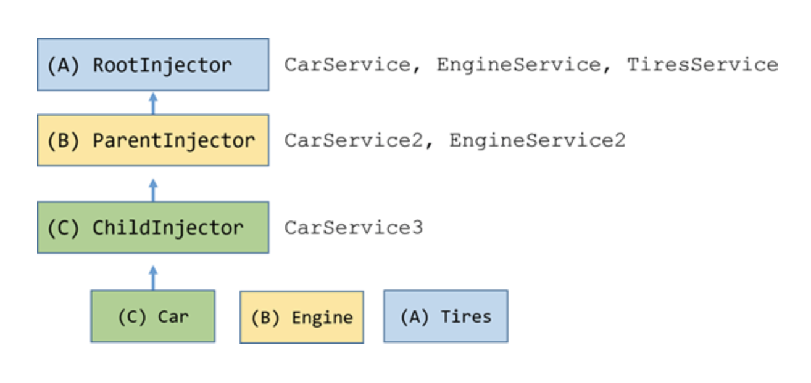

## 设计核心
> 依赖注入Injector为核心,装饰器风格的`多端开发框架`

### 依赖注入
将`Class`构建过程托管给系统`依赖注入`

### 装饰器
`装饰器`方便开发者组织和开发响应业务逻辑。

### 装饰器解析
系统运行注册`装饰器解析器`，让`装饰器`生效。可根据不同平台或业务场景定制不同的`装饰器解析器`。

### 平台
提供`装饰器解析器`及该平台运行的基础服务。

### 模块
一个完整功能的集合，便于代码复用。

### 控制器
用于`Controller`层。全局生效。

### 服务
为`Controller`或其他`服务`提供一组功能服务,导出后全局生效。

